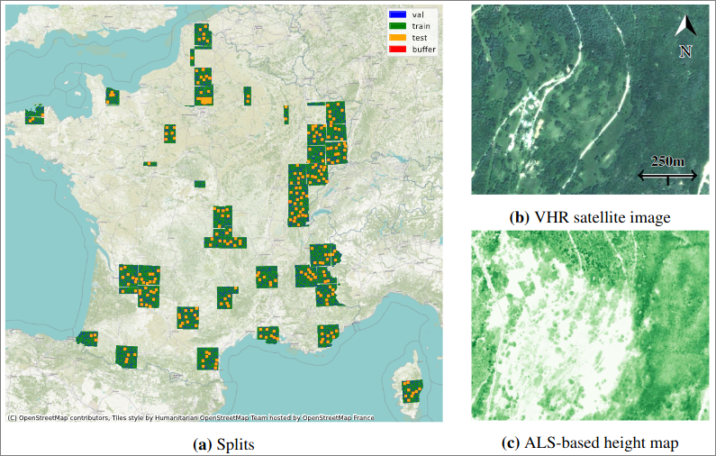

# Open-Canopy: a Country-Scale Dataset for Canopy Height Estimation at Very High Resolution

 [](https://github.com/IGNF/FLAIR-1-AI-Challenge/blob/master/LICENSE) <a href="https://pytorch.org/get-started/locally/"></a>
<a href="https://pytorchlightning.ai/"></a>    [](https://github.com/etalab/licence-ouverte/blob/master/open-licence.md)

This is the official repository associated with the pre-print: "Open-Canopy: A Country-Scale Benchmark for Canopy Height Estimation at Very High Resolution".

This repository includes the code needed to reproduce all experiments in the paper.

- **Datapaper :** Pre-print on arXiv: https://arxiv.org/abs/2407.09392.

- **Dataset link :** https://huggingface.co/datasets/AI4Forest/Open-Canopy.

- **Size :** Approximately 360GB, including predictions on test set and pretrained models.

<!-- - **Github link :** https://github.com/fajwel/Open-Canopy.  -->

## Context & Data

Estimating canopy height and canopy height change at meter resolution from satellite imagery has numerous applications, such as monitoring forest health, logging activities, wood resources, and carbon stocks. However, many existing forestry datasets rely on commercial or closed data sources, restricting the reproducibility and evaluation of new approaches. To address this gap, we introduce Open-Canopy, an open-access and country-scale benchmark for very high resolution (1.5 m) canopy height estimation.
Covering more than 87,000 km2 across France, Open-Canopy combines [SPOT 6-7](https://openspot-dinamis.data-terra.org/) satellite imagery with high resolution aerial [LiDAR data](https://geoservices.ign.fr/lidarhd).
Additionally, we propose a benchmark for canopy height change detection between two images taken at different years, a particularly challenging task even for recent models.
To establish a robust foundation for these benchmarks, we evaluate a comprehensive list of state-of-the-art computer vision models for canopy height estimation.

*Examples of canopy height estimation*

<p align="center">
  <figure style="display: inline-block; margin: 0 20px;">
    
  </figure>
</p>

*Example of canopy height change estimation*

<p align="center">
  <figure style="display: inline-block; margin: 0 20px;">
    
  </figure>
</p>

## Dataset Structure

A full description of the dataset can be found in the supplementary material of the [Open-Canopy article](https://arxiv.org/abs/2407.09392).

Our training, validation, and test sets cover most of the French territory. Test tiles are separated from train and validation tiles by a 1km buffer (a).

For each tile, we provide VHR images at a 1.5 m resolution (b) and associated LiDAR-derived canopy height maps (c).



## Installation

### System requirements

- Storage: 360GB of available storage to download the dataset.
- Training: a recent GPU to train models with default configs (e.g., V100 32GB, A100, RTX8000...).

### Python environment

We provide here instructions for installation with miniconda/mamba.
Installation was tested on Mac and Linux.

If you are installing on a computer without GPU, update the `environment.yaml`file (uncomment `cpu_only`and comment `pytorch-cuda=11.8`).

```bash
# Clone the project
git clone https://github.com/Open-Canopy
cd Open-Canopy

# create a conda environment for Open-Canopy and install dependencies
conda env create -f environment.yaml -n canopy
# If it doesn't work setting channel-priority to flexible can help
# conda config set channel_priority flexible

# activate conda environment
conda activate canopy
```

Note: Open-Canopy makes use of [rootutils](https://github.com/ashleve/rootutils) so you do not have to install Open-Canopy with pip.
Once you have the environment ready, see the [Usage](#usage) section to run scripts.

### Download models pretrained on ImageNet

A [script](scripts/download_pretrained.sh) is provided to download all the models finetuned in the benchmark.

```bash
# Supposing you are at the root or Open-Canopy
# make script executable
chmod +x scripts/download_pretrained.sh

# run script
scripts/download_pretrained.sh
```

Please refer to the official [github repository](https://github.com/facebookresearch/HighResCanopyHeight) to download *Tolan et al.*'s pretrained model, and copy it at the following location: `Open-Canopy/datasets/Models/tolan_SSLlarge.pth`.

Note: Alternative size of models not used in the benchmark are commented out in the script. An associated config file is also given for all of them.

### Download Open-Canopy dataset

We recommend using [Hugging Face python API](https://huggingface.co/docs/huggingface_hub/guides/download) to download the [Open-Canopy dataset](https://huggingface.co/datasets/AI4Forest/Open-Canopy).

The dataset must be located at the following location: `Open-Canopy/datasets` (unless you change paths in `configs`).
A [script](scripts/download_dataset.py) is provided to do it seamlessly:

```bash
# Supposing you are at the root or Open-Canopy
python scripts/download_dataset.py
```

## Usage

This repository is built upon [PyTorch](https://pytorch.org/). Its structure was bootstrapped from [this code template](https://github.com/ashleve/lightning-hydra-template),
which heavily relies on [Hydra](https://hydra.cc/) and [Pytorch-Lightning](https://github.com/PyTorchLightning/pytorch-lightning). Parameters for training can be accessed and modified through the config files in the `configs` folder or overridden in the command line. Models and dataloaders models were implemented as in https://github.com/archaeoscape-ai/archaeoscape, thanks to [Yohann Perron](https://github.com/yohannperron) and [Vladyslav Sydorov](https://github.com/vsydorov).

### Data preprocessing

See the [preprocessing README](src/preprocessing/README.md) for instructions on processing data from scratch, e.g., if you want to extend Open-Canopy to new areas.

### Retrieve data

As described in the supplementary material of the [paper](https://arxiv.org/abs/2407.09392), SPOT 6-7 imagery, LiDAR height maps and classification rasters can be accessed through virtual files (one per year).

A grid of 1km x 1km tiles is provided in the file "geometries.geojson", with a column "split" indicating to which split each tile belongs ("train"/"val"/"test"/"buffer").

See `examples/visualize_data.py` for an example of how to plot data for a given geometry.

### Train a model

Supposing you are at the root of Open-Canopy.

Train a default model with the default configuration (ViT small):

```bash
python src/train.py
```

Train a Unet with the default configuration:

```bash
python src/train.py model=smp_unet
```

After training, the model automatically proceeds to prediction and evaluation on the test tiles. The resulting metrics, along with other logs in the `logs` directory, are saved in an Excel file for easy reference and analysis.

The list of all commands used for the experiments in the paper can be found in `scripts/canopy.sh`. Some of them make use of the [hydra multirun functionality](https://hydra.cc/docs/tutorials/basic/running_your_app/multi-run/).
Configs for training are located in the `configs`folder at the root of the repository.

### Compute metrics

If you already have height maps, e.g., those provided in the folder `canopy_height/predictions`and `canopy_height_change` of the dataset:

To evaluate height estimation, complete the `src/metrics/configs/compute_metrics.yaml`config and run:

```bash
python src/metrics/compute_metrics.py
```

To evaluate height change estimation, complete the `src/metrics/configs/compute_change_detection_metrics.yaml`config and run:

```bash
python src/metrics/compute_change_detection_metrics.py
```

These two scripts output excel files with computed metrics.

## Pretrained models

Unet and PVTv2 models trained on Open-Canopy are available in the `pretrained_models` folder of the [dataset](https://huggingface.co/datasets/AI4Forest/Open-Canopy/tree/main). Corresponding configs are located at `configs/model/PVTv2_B.yaml`and `configs/model/smp_unet.yaml`.
Additional documentation coming soon.

## Reference

Please include a citation to the following article if you use the Open-Canopy dataset:

```bibtex
@article{fogel2024opencanopy,
      title={Open-Canopy: A Country-Scale Benchmark for Canopy Height Estimation at Very High Resolution},
      author={Fajwel Fogel and Yohann Perron and Nikola Besic and Laurent Saint-André and Agnès Pellissier-Tanon and Martin Schwartz and Thomas Boudras and Ibrahim Fayad and Alexandre d'Aspremont and Loic Landrieu and Philippe Ciais},
      year={2024},
      eprint={2407.09392},
      publisher = {arXiv},
      url={https://arxiv.org/abs/2407.09392},
}
```

## Acknowledgements

This paper is part of the project *AI4Forest*, which is funded by the French National Research Agency ([ANR](https://anr.fr/Projet-ANR-22-FAI1-0002)), the German Aerospace Center ([DLR](https://www.dlr.de/en)) and the German federal ministry for education and research ([BMBF](https://www.bmbf.de/bmbf/en/home/home_node.html)).

The experiments conducted in this study were performed using HPC/AI resources provided by GENCI-IDRIS (Grant 2023-AD010114718 and 2023-AD011014781) and [Inria](https://inria.fr/fr).

Models and dataloaders models were implemented as in https://github.com/archaeoscape-ai/archaeoscape, thanks to [Yohann Perron](https://github.com/yohannperron) and [Vladyslav Sydorov](https://github.com/vsydorov).

## Dataset license

The "OPEN LICENCE 2.0/LICENCE OUVERTE" is a license created by the French government specifically for the purpose of facilitating the dissemination of open data by public administration.
If you are looking for an English version of this license, you can find it at the [official github page](https://github.com/etalab/licence-ouverte).

As stated by the license :

- Applicable legislation: This licence is governed by French law.
- Compatibility of this licence: This licence has been designed to be compatible with any free licence that at least requires an acknowledgement of authorship, and specifically with the previous version of this licence as well as with the following licences: United Kingdom’s “Open Government Licence” (OGL), Creative Commons’ “Creative Commons Attribution” (CC-BY) and Open Knowledge Foundation’s “Open Data Commons Attribution” (ODC-BY).

## Authors

Fajwel Fogel (ENS), Yohann Perron (LIGM, ENPC, CNRS, UGE, EFEO), Nikola Besic (LIF, IGN, ENSG), Laurent Saint-André (INRAE, BEF), Agnès Pellissier-Tanon (LSCE/IPSL, CEA-CNRS-UVSQ), Martin Schwartz (LSCE/IPSL, CEA-CNRS-UVSQ), Thomas Boudras (LSCE/IPSL, CEA-CNRS-UVSQ), Ibrahim Fayad (LSCE/IPSL, CEA-CNRS-UVSQ, Kayrros), Alexandre d'Aspremont (CNRS, ENS, Kayrros), Loic Landrieu (LIGM, ENPC, CNRS, UGE), Philippe Ciais (LSCE/IPSL, CEA-CNRS-UVSQ).
