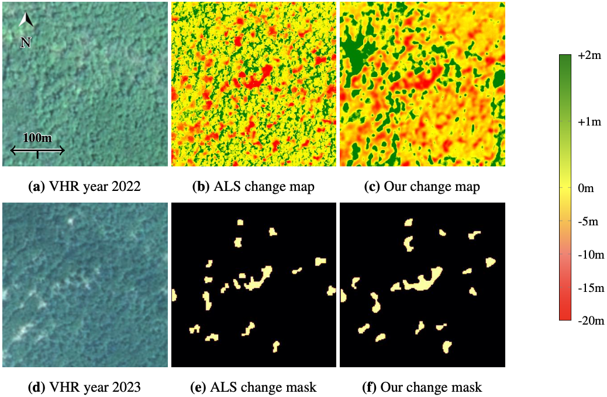

# Open-Canopy
# A Country-Scale Dataset for Canopy Height Estimation at Very High Resolution

  
 &emsp;  

This is the official repository associated with the pre-print: "Open-Canopy: A Country-Scale Benchmark for Canopy Height Estimation at Very High Resolution".

- **Datapaper :** The pre-print will be available on arXiv early July 2024.

- **Dataset link :** https://huggingface.co/datasets/AI4Forest/Open-Canopy.
- **Size :** Approximately 300GB.
<!-- - **Github link :** https://github.com/fajwel/Open-Canopy.  -->

## Context & Data

Estimating canopy height and canopy height change at meter resolution from satellite imagery has numerous applications, such as monitoring forest health, logging activities, wood resources, and carbon stocks. However, many existing forestry datasets rely on commercial or closed data sources, restricting the reproducibility and evaluation of new approaches. To address this gap, we introduce Open-Canopy, an open-access and country-scale benchmark for very high resolution (1.5 m) canopy height estimation. 
Covering more than 87,000 km2 across France, Open-Canopy combines SPOT 6-7 satellite imagery with high resolution aerial LiDAR data.
Additionally, we propose a benchmark for canopy height change detection between two images taken at different years, a particularly challenging task even for recent models. 
To establish a robust foundation for these benchmarks, we evaluate a comprehensive list of state-of-the-art computer vision models for canopy height estimation. 

*Examples of canopy height estimation*

  <figure style="display: inline-block; margin: 0 20px;">
    
  </figure>

*Example of canopy height change estimation*

  <figure style="display: inline-block; margin: 0 20px;">
    
  </figure>

## Dataset Structure
A full description of the dataset can be found in the supplementary material of the paper.
<!-- ### Annotations
### Data Splits -->

## Usage
Codes for preprocessing, training a custom model and evaluation will be available soon.

<!-- ### Data preprocessing
### Training a custom model
### Pretrained models
### Estimating canopy height
### Evaluation of canopy height estimation
### Evaluation of canopy height change estimation -->

## Acknowledgements
This paper is part of the project *AI4Forest*, which is funded by the French National Research Agency ([ANR](https://anr.fr/Projet-ANR-22-FAI1-0002)), the German Aerospace Center ([DLR](https://www.dlr.de/en)) and the German federal ministry for education and research ([BMBF](https://www.bmbf.de/bmbf/en/home/home_node.html)).
The experiments conducted in this study were performed using HPC/AI resources provided by GENCI-IDRIS (Grant 2023-AD010114718 and 2023-AD011014781) and [Inria](https://inria.fr/fr).

## Dataset license

The "OPEN LICENCE 2.0/LICENCE OUVERTE" is a license created by the French government specifically for the purpose of facilitating the dissemination of open data by public administration. 
If you are looking for an English version of this license, you can find it on the official GitHub page at the [official github page](https://github.com/etalab/licence-ouverte).

As stated by the license :

### Applicable legislation

This licence is governed by French law.

### Compatibility of this licence

This licence has been designed to be compatible with any free licence that at least requires an acknowledgement of authorship, and specifically with the previous version of this licence as well as with the following licences: United Kingdom’s “Open Government Licence” (OGL), Creative Commons’ “Creative Commons Attribution” (CC-BY) and Open Knowledge Foundation’s “Open Data Commons Attribution” (ODC-BY).

## Authors
Fajwel Fogel (ENS), Yohann Perron (LIGM, ENPC, CNRS, UGE, EFEO), Nikola Besic (LIF, IGN, ENSG), Laurent Saint-André (INRAE, BEF), Agnès Pellissier-Tanon (LSCE/IPSL, CEA-CNRS-UVSQ), Martin Schwartz (LSCE/IPSL, CEA-CNRS-UVSQ), Thomas Boudras (LSCE/IPSL, CEA-CNRS-UVSQ), Ibrahim Fayad (LSCE/IPSL, CEA-CNRS-UVSQ, Kayrros), Alexandre d'Aspremont (CNRS, ENS, Kayrros), Loic Landrieu (LIGM, ENPC, CNRS, UGE), Philippe Ciais (LSCE/IPSL, CEA-CNRS-UVSQ).
